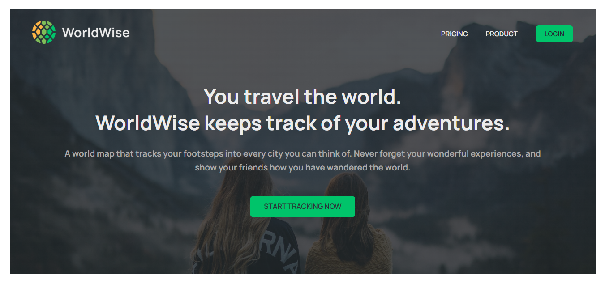
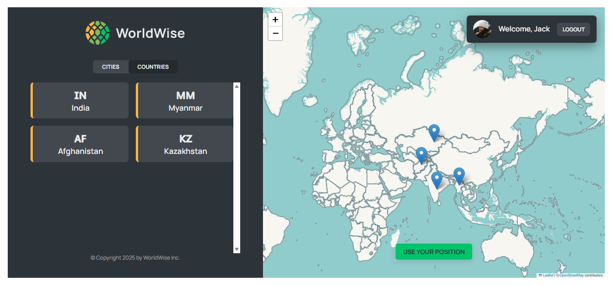
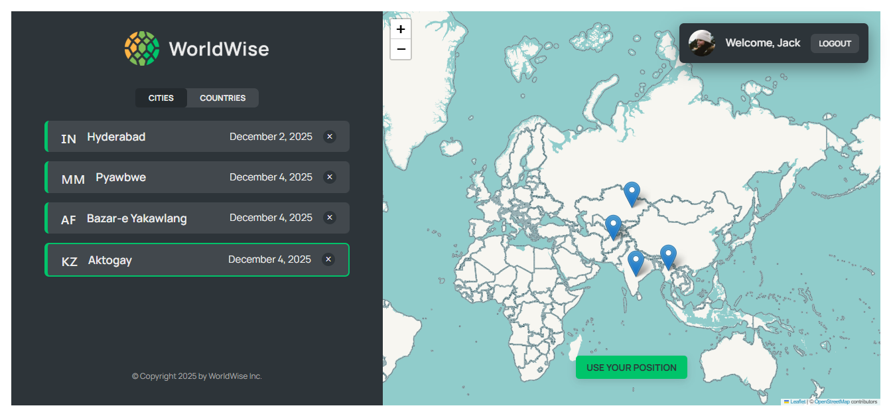

# WorldWise

**WorldWise** is a travel-loggin web app built with React that lets users record, and visualize their travel history - helping you keep track of where you've been and plan where to go next.

## Tech Stack

- React
- React Router
- React-Leaflet/Leaflet.js

#### State Management

- React Context + useReducer

---

To run this project locally:

#### 1. Clone this repository

```
git clone https://github.com/Aliya032/Track-Your-Adventures.git

cd Track-Your-Adventures
```

#### 2. Install dependencies

```
npm install
```

#### 3. Start the development server and json server

```
npx json-server --watch data/cities.json --port 8000
npm run dev
```

#### 4. Open the app in the browser

```
by default at http://localhost:5173
```

---

### Screenshots




